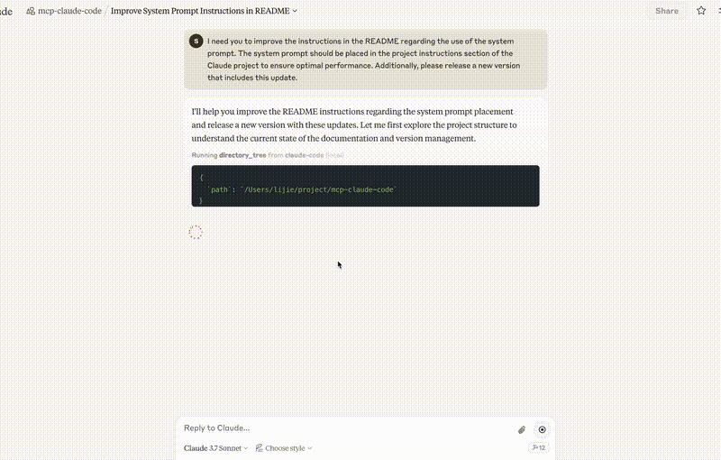

# Hanzo MCP

[](https://mcp.hanzo.ai)
[](https://hanzo.app/launch?repo=https://github.com/hanzoai/mcp)
[](https://hanzo.app/dev?repo=https://github.com/hanzoai/mcp&action=feature)
[](https://hanzo.app/dev?repo=https://github.com/hanzoai/mcp&action=bugfix)

An implementation of Hanzo capabilities using the Model Context Protocol (MCP).

## Overview

Hanzo MCP is the most comprehensive Model Context Protocol implementation available, featuring **65+ professional tools** that transform Claude into a powerhouse development environment. Built for real-world software development, it provides everything from basic file operations to advanced AI orchestration in a single, unified interface.



## Features

### 🚀 65+ Professional Tools
- **File Operations**: read, write, edit, multi_edit, tree, find
- **Search & Analysis**: grep, symbols, search, git_search, vector_search
- **Shell & Process**: run_command, processes, pkill, npx, uvx
- **Development**: jupyter, neovim, todo, database tools
- **AI & Automation**: agent orchestration, LLM consensus, MCP servers
- **And many more**: All following the Unix philosophy of doing one thing well

### 🎯 Key Capabilities
- **Intelligent Search**: Multi-modal search combining text, AST, vector embeddings, and git history
- **Action-Based Architecture**: Tools like `sql`, `graph`, `llm` support multiple actions through a unified interface
- **Enterprise Security**: Fine-grained permissions, secure command execution, and comprehensive audit trails
- **Parallel Execution**: Run multiple operations concurrently for maximum performance
- **Smart Defaults**: Automatic encoding detection, backend selection, and error recovery

## Tools Overview

Hanzo MCP provides 65+ tools organized by category, following the principle of **one tool per orthogonal task** with multiple actions where appropriate.

### Core File Operations
| Tool              | Description                                                                         |
| ----------------- | ----------------------------------------------------------------------------------- |
| `read`            | Read files with encoding detection and pagination                                   |
| `write`           | Create or overwrite files                                                           |
| `edit`            | Precise line-based edits with pattern matching                                      |
| `multi_edit`      | Batch edits to a single file                                                        |
| `tree`            | Unix-style directory tree visualization                                             |
| `find`            | Fast file finding (rg > ag > ack > grep)                                            |

### Search Tools
| Tool              | Description                                                                         |
| ----------------- | ----------------------------------------------------------------------------------- |
| `grep`            | Fast pattern search using ripgrep                                                   |
| `symbols`         | AST-aware symbol search using tree-sitter                                           |
| `search`          | Multi-modal search (text, vector, AST, git, symbols)                                |
| `git_search`      | Search git history (commits, diffs, logs, blame)                                    |
| `vector_search`   | Semantic similarity search using embeddings                                         |

### Shell & Process Tools
| Tool              | Description                                                                         |
| ----------------- | ----------------------------------------------------------------------------------- |
| `run_command`     | Execute shell commands with timeout and environment control                         |
| `run_background`  | Background process execution                                                        |
| `processes`       | List and monitor running processes                                                  |
| `pkill`           | Terminate processes by name/pattern                                                 |
| `npx`/`uvx`       | Run Node.js/Python packages directly                                                |

### Database Tools
| Tool              | Description                                                                         |
| ----------------- | ----------------------------------------------------------------------------------- |
| `sql`             | SQL database operations (actions: query, search, stats)                             |
| `graph`           | Graph database operations (actions: add, remove, query, search, stats)              |

### Development Tools
| Tool              | Description                                                                         |
| ----------------- | ----------------------------------------------------------------------------------- |
| `jupyter`         | Jupyter notebook operations (actions: read, edit)                                   |
| `neovim`          | Advanced text editing with Vim                                                      |
| `todo`            | Task management (actions: read, write)                                              |

### AI/Agent Tools
| Tool              | Description                                                                         |
| ----------------- | ----------------------------------------------------------------------------------- |
| `agent`           | Launch specialized sub-agents for task delegation                                   |
| `llm`             | Query multiple LLM providers (actions: query, list, consensus)                      |
| `mcp`             | Manage MCP server connections (actions: add, remove, list, stats)                   |

### System Tools
| Tool              | Description                                                                         |
| ----------------- | ----------------------------------------------------------------------------------- |
| `config`          | Git-style configuration management                                                  |
| `stats`           | System and usage statistics                                                         |
| `tool_enable`     | Enable tools at runtime                                                             |
| `tool_disable`    | Disable tools at runtime                                                            |
| `batch`           | Execute multiple operations atomically                                              |
| `think`           | Structured reasoning space                                                          |

For detailed documentation on all tools, see [mcp.hanzo.ai/tools](https://mcp.hanzo.ai/tools) or [TOOLS_DOCUMENTATION.md](./TOOLS_DOCUMENTATION.md).

## Getting Started

### 🚀 Try it Instantly in Hanzo.App

**No setup required!** Launch this project instantly in your browser:

[](https://hanzo.app/launch?repo=https://github.com/hanzoai/mcp)

### Quick Install

```bash
# Install using uv
uv pip install hanzo-mcp

# Or using pip
pip install hanzo-mcp
```

### Claude Desktop Integration

To install and configure hanzo-mcp for use with Claude Desktop:

```bash
# Install the package globally
uv pip install hanzo-mcp

# Install configuration to Claude Desktop with default settings
hanzo-mcp --install
```

For development, if you want to install your local version to Claude Desktop:

```bash
# Clone and navigate to the repository
git clone https://github.com/hanzoai/mcp.git
cd mcp

# Install and configure for Claude Desktop
make install-desktop

# With custom paths and server name
make install-desktop ALLOWED_PATHS="/path/to/projects,/another/path" SERVER_NAME="hanzo"

# Disable write tools (useful if you prefer using your IDE for edits)
make install-desktop DISABLE_WRITE=1
```

After installation, restart Claude Desktop. You'll see "hanzo" (or your custom server name) available in the MCP server dropdown.

For detailed installation and configuration instructions, please refer to the [documentation](./docs/).

Of course, you can also read [USEFUL_PROMPTS](./docs/USEFUL_PROMPTS.md) for some inspiration on how to use hanzo-mcp.

## Security

This implementation follows best practices for securing access to your filesystem:

- Permission prompts for file modifications and command execution
- Restricted access to specified directories only
- Input validation and sanitization
- Proper error handling and reporting

## Documentation

📚 **Full documentation is available at [mcp.hanzo.ai](https://mcp.hanzo.ai)**

You can also build and view the documentation locally:

```bash
# Build the documentation
make docs

# Start a local server to view the documentation
make docs-serve
```

The documentation includes:
- Detailed tool references for all 65+ tools
- Step-by-step tutorials and guides
- Architecture and design philosophy
- Integration examples
- API reference

Then open http://localhost:8000/ in your browser to view the documentation.

## Development

### Setup Development Environment

```bash
# Clone the repository
git clone https://github.com/hanzoai/mcp.git
cd mcp

# Install Python 3.13 using uv
make install-python

# Setup virtual environment and install dependencies
make setup

# Or install with development dependencies
make install-dev
```

### Testing

```bash
# Run tests
make test

# Run tests with coverage
make test-cov
```

### Building and Publishing

```bash
# Build package
make build

# Version bumping
make bump-patch    # Increment patch version (0.1.x → 0.1.x+1)
make bump-minor    # Increment minor version (0.x.0 → 0.x+1.0)
make bump-major    # Increment major version (x.0.0 → x+1.0.0)

# Manual version bumping (alternative to make commands)
python -m scripts.bump_version patch  # Increment patch version
python -m scripts.bump_version minor  # Increment minor version
python -m scripts.bump_version major  # Increment major version

# Publishing (creates git tag and pushes it to GitHub)
make publish                     # Publish using configured credentials in .pypirc
PYPI_TOKEN=your_token make publish  # Publish with token from environment variable

# Publishing (creates git tag, pushes to GitHub, and publishes to PyPI)
make patch    # Bump patch version, build, publish, create git tag, and push
make minor    # Bump minor version, build, publish, create git tag, and push
make major    # Bump major version, build, publish, create git tag, and push

# Publish to Test PyPI
make publish-test
```

### Contributing

**New contributors welcome!** 🎉 We've made it easy to contribute:

[](https://hanzo.app/dev?repo=https://github.com/hanzoai/mcp&action=contribute)

**Traditional approach:**

1. Fork the repository
2. Create a feature branch (`git checkout -b feature/amazing-feature`)
3. Commit your changes (`git commit -m 'Add some amazing feature'`)
4. Push to the branch (`git push origin feature/amazing-feature`)
5. Open a Pull Request

**Or use Hanzo Dev for AI-assisted contributions:**
- [Launch in Hanzo.App](https://hanzo.app/launch?repo=https://github.com/hanzoai/mcp) for instant setup
- [Add new features](https://hanzo.app/dev?repo=https://github.com/hanzoai/mcp&action=feature) with AI assistance
- [Fix bugs automatically](https://hanzo.app/dev?repo=https://github.com/hanzoai/mcp&action=bugfix)

See [CONTRIBUTING.md](./CONTRIBUTING.md) for detailed guidelines.

## License

This project is licensed under the MIT License - see the LICENSE file for details.
